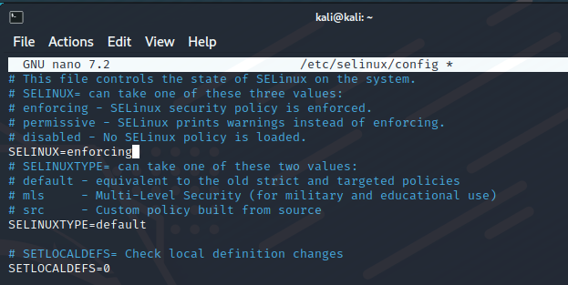

Chapter 9, Implementing Mandatory Access Control with SELinux and AppArmor

## Table of content
- [Table of content](#table-of-content)
- [How SELinux can benefit a systems administrator](#how-selinux-can-benefit-a-systems-administrator)
- [Setting security contexts for files and directories](#setting-security-contexts-for-files-and-directories)
  - [Installing the SELinux tools](#installing-the-selinux-tools)
  - [Creating web content files with SELinux enabled](#creating-web-content-files-with-selinux-enabled)
  - [Fixing an incorrect SELinux context](#fixing-an-incorrect-selinux-context)
  - [Hands-on lab – SELinux type enforcement](#hands-on-lab--selinux-type-enforcement)
- [Troubleshooting with setroubleshoot](#troubleshooting-with-setroubleshoot)
  - [Viewing setroubleshoot messages](#viewing-setroubleshoot-messages)
  - [Using the graphical setroubleshoot utility](#using-the-graphical-setroubleshoot-utility)
  - [Troubleshooting in permissive mode](#troubleshooting-in-permissive-mode)
- [Working with SELinux policies](#working-with-selinux-policies)
- [How AppArmor can benefit a systems administrator](#how-apparmor-can-benefit-a-systems-administrator)
- [Looking at AppArmor profiles](#looking-at-apparmor-profiles)
- [Working with AppArmor command-line utilities](#working-with-apparmor-command-line-utilities)
- [Troubleshooting AppArmor problems](#troubleshooting-apparmor-problems)
- [Exploiting a system with an evil Docker container](#exploiting-a-system-with-an-evil-docker-container)

## How SELinux can benefit a systems administrator

- **SELinux** is a free open source software project, three ways to used:
  - Help prevent intruders from exploiting a system
  - Ensure that only users with the proper security clearance can access files that are labeled with a security classification.
  - in addition to MAC, SELinux can be used as a type of role-based access control

- **SELinux** is also can help protect data in users's home directories. 
- On web servers, **SELinux** can help to prevent the execution of malicious CGI scripts or PHP scripts
- With Docker and without MAC, it is a useful tools for hardening servers that run Docker containers.

## Setting security contexts for files and directories

- SELinux as a glorified labeling system
  - It adds labels - security context to files and directories through extended file attributes. 
  - It adds the same type of labe - domains to system processes
- Use `ps -Z`, `ls -Z` to see these context and domains, output will contains user, role, type, sensitivity, category.
  
### Installing the SELinux tools

- Run `sestatus` to check status of SELinux

### Creating web content files with SELinux enabled

### Fixing an incorrect SELinux context

- `chcon`
- `restorecon`
- `semanage`:
  - Change by `chcon` or `restorecon` won't survive

### Hands-on lab – SELinux type enforcement

## Troubleshooting with setroubleshoot

### Viewing setroubleshoot messages

- When something violates an SELinux rule, it gets logged in the */var/log/audit/audit.log* file
- The beauty of setroubleshoot is that it takes cryptic, hard-to-interpet SELinux message from file `audit.log`, and translate them into plain, natural language. 

### Using the graphical setroubleshoot utility

- There is a graphical utility that will automatically alert you when setroubleshoot detects a problem.

### Troubleshooting in permissive mode

- Use when you might have more than one problem.
- In permissive mode, SELinux allows actions that violate policy to occur, but it will log them
- 

## Working with SELinux policies

## How AppArmor can benefit a systems administrator

## Looking at AppArmor profiles

## Working with AppArmor command-line utilities

## Troubleshooting AppArmor problems

## Exploiting a system with an evil Docker container