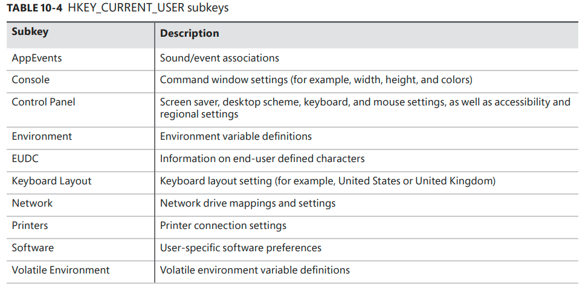
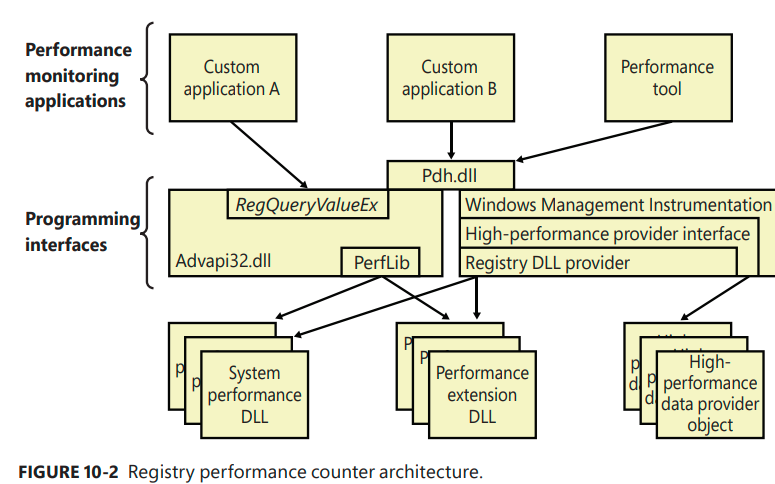

# Management diagnostics and tracing

## Table of contents

## The Registry

- It is the repository
for both systemwide and per-user settings --> plays a key role in the configuration and control of Windows systems

## Viewing and changing the registry

- `Regedit.exe` : main GUI tool for editing the registry.
- `Reg.exe` : can import, export, back up, and restore keys, as well as to compare, modify, and delete keys and values. It can also set or query flags used in UAC virtualization
- `Regini.exe` : allows you to import registry data based on text files that contain ASCII or Unicode configuration data.
- `Offreg.dll` (from WDK): Host the Offline Registry Library, this library allows loading registry key hive files in their binary format and applying operations on the files themselves, bypassing the usual logical loading and mapping that Windows requires for registry operations

## Registry usage
- When is it read?
    - During the initial boot process
    - During the kernel boot process
    - During logon, Explorer and other Windows components read per-user preferences
    - During applications startups.
- When is it modified?
    - During the installation of a device driver
    - Application setup utilities create default application settings
    - When you change application or system settings through user interface.
    - Many default settings are defined by a prototype version of the registry that ships on the Windows setup media.

## Registry data type

- Contain:
    - `keys` : consist of other keys (subkeys or values)
    - `values` : store data

## Registry logical structure

> Note: H in root key means Windows Handle Key

## HKEY_CURRENT_USER 
- Contains data regarding the preferences and software       configuration of the locally
logged-on user

## HKEY_USERS
- Contains subkeys for all loaded user profiles

## HKEY_CLASSES_ROOT
- Contains file association and COM registration information
- Consist of three types of information: 
  - File extension associations.
  - COM class registrations.
  - The Virtualized registry root for User Account Control (UAC) 
- Data under HKCR comes from two sources:
  - The per-user class registration data in HKCU\SOFTWARE\Classes (mapped to the file on hard
disk \Users\<username>\AppData\Local\Microsoft\Windows\Usrclass.dat)
  - Systemwide class registration data in HKLM\SOFTWARE\Classes

## HKEY_LOCAL_MACHINE
- Global settings for the machine
- Contains all the systemwide configuration subkeys:
  - `BCD00000000` :  Boot Configuration Database (BCD) information. BCDEdit command-line utility allows you to modify the BCD using symbolic names for the elements and objects
  - `COMPONENTS` :  information pertinent to the Component-Based
Servicing (CBS) stack (this stack contains various files and resources that are part of a Windows installation image)
  - `HARDWARE` : descriptions of the system’s legacy hardware and some  hardware device-to-driver mappings
  - `SAM`(Security Account Manager) : holds local account and group information, such as user passwords, group definitions, and domain associations.
  - `SECURITY` : stores systemwide security policies and user-rights assignments
  - `SOFTWARE` : stores systemwide configuration information not needed to boot the system, paths to application files and directories, and licensing and expiration date information of third-party applications.
  - `SYSTEM` : contains the systemwide configuration information needed to boot the system (which device drivers to load and which services to start)

#### HKEY_CURRENT_CONFIG
- Current hardware profile
- Stored under HKLM\SYSTEM\
CurrentControlSet\Hardware Profiles\Current
- Exists to support legacy applications that might depend on its presence
#### HKEY_PERFORMANCE_DATA and HKEY_PERFORMANCE_TEXT
- Both registry keys are the mechanism used to access performance counter values on Windows. 
- HKEY_PERFORMANCE_DATA:
  - Contains actual system performance data: processor usage, memory usage, and disk activity,..
  - Can't see in **Registry Editor**
  - Available only through the Windows registry functions (ex *RegQueryValueEx).
- HKEY_PERFORMANCE_TEXT:
  - A subkey of HKEY_LOCAL_MACHINE\SOFTWARE\Microsoft\Windows NT\CurrentVersion\Perflib
  - Contains the text strings used to display the performance data in a human-readable format.
  -
   
- We also can use `Performance Data Helper (PDH)` to 
  

### Application hives

- An application hive is a standard hive file (which is linked to the proper log files) that can be mounted visible only to the application that requested it.
- Developer can create a base file by using RegSaveKeyEx API, then the application mount the hive privately using RegLoadAppKey function
- The application can use standard registry APIs to read and write its own settings, which will be stored in the application hive.
- The Application hive will be automatically unloaded when the application exits or when the last handle to the key is closed.
- Application hives are use by different Windows component:
  - Application Compatibility telemetry agent (CompatTelRunner.exe) 
  - The Modern Application Model

### Transactional Registry (TxR)

- `Kernel Transaction Manager (KTM)` : By access to a straightforward API, it help people implement a robust error-recovery capabilities when performing registry operations.
- Three APIs support transactional modification of the Registry:
  - *RegCreateKeyTransacted*
  - *RegOpenKeyTransacted*
  - *RegDeleteKeyTransacted* : to ensure that the deletion of subkeys is also included in a transaction and is therefore rolled back if the transaction is rolled back.
- Data for these transacted operations is written to log files using `Common logging file system (CLFS)` services.
- Transactions are isolated from each other, and the isolation level implemented by TxR resource managers is read-commit.
- To make permanent changes to the registry, the applications use the transaction handle must call *CommitTransaction*
- The TxR stores its own internal log files in %SystemRoot%\System32\Config\Txr folder on the system volume.
- `Resource Manager (RM)`
  - Services all the hives mounted at boot time. For every hive that is mounted explicitly, an RM is created
  - The internal log files used by the RM are stored in the %SystemRoot%\System32\Config\Txr folder on the system volume, with a .regtrans-ms extension

### Monitoring registry activity
- It’s virtually impossible to know what registry keys or values are misconfigured without understanding how the system or the application that’s failing is accessing the registry. 
- Use Process Monitor to monitor registry activity as it occurs. It shows the process that performed the access, the time, type, and result of the access; and the stack of the thread at the moment.      

### Process monitor internals

### Registry Internal

### Hive reorganization

### The registry namespace and operation

### Stable storage

### Registry filtering

### Registry virtualization

### Registry optimizations

----------------------

## Windows services
## Task scheduling and UBPM
## Windows Management Instrumentation
## Event Tracing for Windows (ETW)
## Dynamic tracing (DTrace)
## Windows Error Reporting (WER)
## Global flags
## Kernel shims

