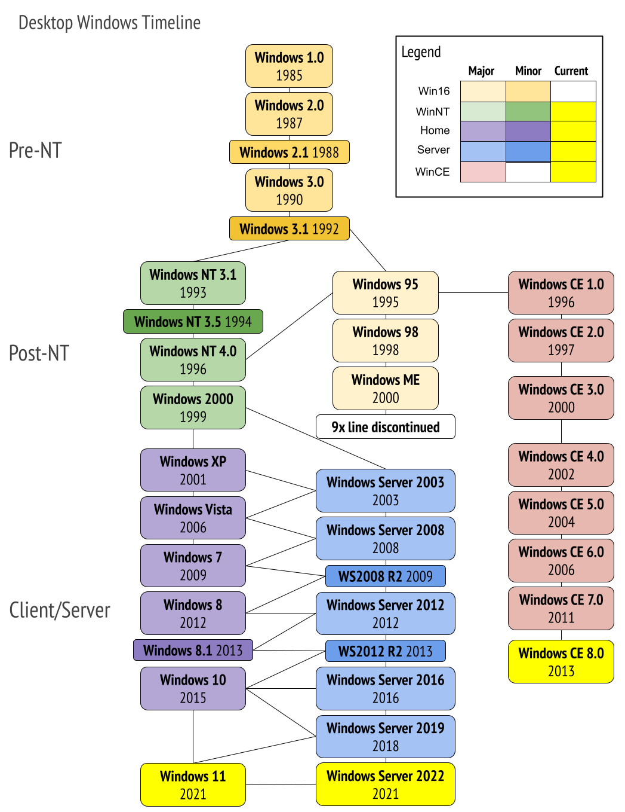
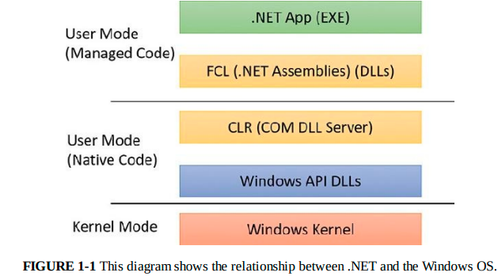
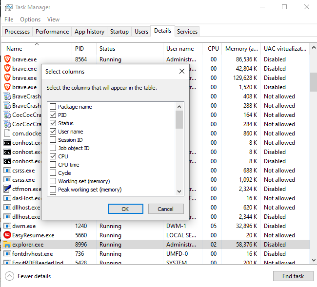
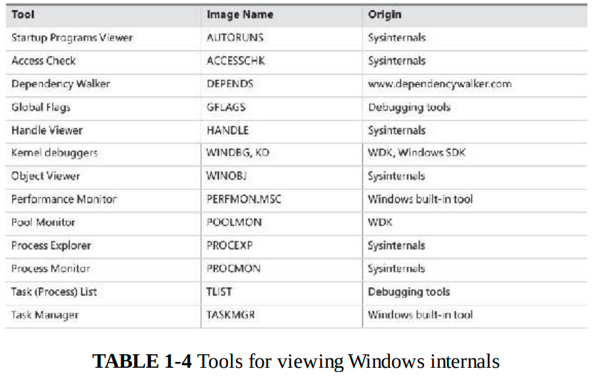

# Windows Internals

Created: January 29, 2023 10:36 PM

# Chapter 1: Concepts and tools

Introduce some concepts and tools will using in this book

A **process** is an instance of a program that is executed by one or many threads. It is a self-contained program with its own memory space, system resources, and security context.

A **thread**, on the other hand, is a unit of execution within a process. It is a lightweight and independent flow of control within a process that can run parallel to other threads within the same process. Threads within a process share the same memory space and system resources, and can communicate with each other efficiently. This allows multiple tasks to be performed concurrently within a single process, increasing the overall efficiency and performance of the system.

- **Window API** : consist of many callable functions
    - Base services
    - Component Services
    - User Interface Services
    - Graphics and Multimedia Services
    - Messaging and Collaboration
    - Networking
    - Web services

**********.NET********** : The Microsoft .NET Frame work consists a library of classes called the Framework Class (FCL) and a Common Language Runtime (CLR) that 

**Virtual Memory :** a system based on a linear address space

## Windows operating system versions

Run `winver` on **********Start********** to see information of windows version.

Windows 10 and future windows version

Windows 10 and OneCore

## Foundation and terms

### Windows API

- Windows API (application programming interface) is the user-mode system programming interface to the Windows OS family.
- Described in the Windows SDK documentation.
    
    **Windows API flavors:**
    
    - Component Object Model (COM):
        - a mechanism of windows API
        - originally created to enable Microsoft Office applications to communicate and exchange data between documents (Object Linking and Embedding - OLE).
        - based on two foundational principles:
            - clients communicate with objects through interfaces with a set of logically related methods grouped under the virtual table dispatch mechanism
            - Component implementation is loaded dynamically rather than being statically linked to the client
        - COM server: a Dynamic Link Library (DLL) or an executable (EXE) where the COM classes are implemented.
        - Example of APIs accessed through COM: DirectShow, Windows Media Foundation, DirectX, ..
    
    **The Windows Runtime**
    
    - For Windows 8 and later version to supporting runtime (WinRT not Windows RT)
    - consist of platform services aimed  app developers for Windows Apps (Metro Apps, Modern Apps, Immersive Apps, Windows Store Apps)
    - Built on top of COM, adding various extensions to the base COM infrastructure.
    
    **The .NET Framework**
    
    - is a part of windows
    - Consists of two major components:
        - The Common Language Runtime (CLR): The run-time engine for .NET and includes a Just In Time (JIT) Compiler that translates Common Intermediate Language (CLL) instructions to the underlying hardware CPU machine language, a garbage collector, type verification, code access security, and more. It’s implemented as a COM in-process server (DLL) and uses various facilities provided by the Windows API.
        - The .NET Framework Class Library (FCL) This is a large collection of types that implement functionality typically needed by client and server applications, such as user interface services, networking, database access, and much more

### Services, functions and routines

- Windows API functions
- Native system services (or system calls)
- Kernel support functions (or routines)
- Windows services
- Dynamic link libraries (DLLs)

### Processes

- A process is a container for a set of resources used when executing the instance of the program
- A Windows process comprises:
    - A private virtual address space: a set of virtual memory addresses
    - An executable program: initial code and data is mapped in to the process’s virtual address
    - A list of open handles: nap to various system resources such as semaphores, synchronization objects, and files that are accessible to all threads in the process
    - A security context: an access token that identifies the user, security groups, privileges, attributes, claims, capabilities, User Account Control (UAC) virtualization state, session, and limited user account state with the process
    - A process ID: A unique identifier
    - At least one thread of execution
- Viewing process information with Task manager. We can right-click on the header row and click ******************************Select Columns****************************** to see more info in tab ************details************

- Process Explorer (from Sysinternals)

### Threads

- A thread is an entity within a process that Windows schedules for execution.
- Includes:
    - Contents of a set of CPU register representing the state of the processor
    - Two stacks - one for the thread to use while executing in kernel mode and one for executing in user mode
    - A private storage area (thread-local storage TLS): use by subsystems, runtime libraries and DLLs
    - Thread ID
- Fibers: lightweight threads
- User-mode scheduling threads (UMS)

### Jobs

- An extension to the process model
- Main function is to allow the management and manipulation of groups of processes as a unit

### Virtual memory

- provide a logical view of memory
- At run time, the memory manager translates of maps the virtual addresses into physical addresses. By controlling the protection and mapping, the OS ensure individual processes don’t bump with each other or overwrite OS data
- When Ram not enough to store all the necessary data to the hard drive to free up Ram for other programs to use
- Paging: allows a program to operate with a larger memory size than the available RAM. it divides the memory for a program into smaller pages and transfer these pages to extended memory (virtual memory)
- AWE: a feature that Windows OS allows a program to access a larger amount of memory than the available RAM

### Kernel mode vs. user mode

User application code runs in user mode. OS code (system services and device drivers) runs in kernel mode 

Kernel mode :

- a mode that process will be executed has access rights with all system memory and all CPU instructions.
- Don’t provide any protection for private read/write system memory

Data Execution Prevention (DEP): On process support no-execute memory protection, Windows marks pages containing data as non-executable.

Digital rights management (DRM)

Windows Hardware Quality Labs (WHQL): driver on Windows 10 need to pass through it to be sign (which provide certain compatibility, security, performance, and stability assurances to system administrators)

Use Performance Monitor to see how much time your system spends executing in kernel mode and in user mode.

### Hypervisor

Hypervisor: a specialized and highly privileged component that allows for the virtualization and isolation of all resources on the machine, from virtual to physical memory, to device interrupts, and even to PCI and USB devices

Virtualization-based security (VBS): 

- Device Guard: provides Hyper visor Conde Integrity (HVCI) for strong code-signing guarantees, allows for the customization of the signature policy of the windows OS
- Hyper Guard: Protects key kernel-related and hypervisor-related data structures and code.
- Credential Guard: prevents unauthorized access to domain account credentials and secrets, combined with secure biometrics.
- Applications Guard: strong sandbox for ME browser
- Host Guardian and Shielded Fabric: leverage v-TPM to protect a vm from infrastructure it’s running on

Hyper-V enables certain key kernel mitigations against exploits and other attackers.

### Firmware

What can ensure Windows components are loaded secure and can authenticate their contents ⇒ Microsoft manages the white list and backlist of the UEFI secure boot component

### Terminal Services and multiple sessions

Allow user can access to remote machine, login, use all resources and run applications on remote machine

### Objects and handles

Object:

- Type
- Attribute
- Methods

Object manager helps to complete the following four important OS tasks:

- Providing human-readable names for system resources
- Sharing resources and data among processes
- Protecting resources from unauthorized access
- Reference tracking, which allows the system to recognize when an object is no longer in use so that it can be automatically deallocated

### Security

The core security capabilities of Windows include:

- Discretionary (need-to-know) and mandatory protection for all shareable system objects, such as files, directories, processes, threads, and so forth
- Security auditing for accountability of subjects, or users, and the actions they initiate
- User authentication at logon
- The prevention of one user from accessing uninitialized resources, such as free memory or disk space, that another user has deallocated

Windows has three forms of access control over objects:

- Discretionary access control: when owners of objects grant or deny access to others.
- Privileged access control: Ensuring that someone can get to protected objects if the owner isn’t available
- Mandatory integrity control: to protect objects that are being accessed from within the same user account by the sandboxing technology for Windows Apps

### Registry

Registry is the system database that contains the information  required to boot and configure the system, system-wide software, settings that control the operation of Windows, the security database, and per-user configuration settings

### Unicode

Most internal text strings on Windows are stored and process as 16-bit-wide Unicode Characters.

Unicode is an international character set standard that defines unique values for most of the world’s known character sets, and provides 8, 16, and even 32-bit encodings for each character.

## Digging into Windows Internals

### Performance Monitor and Resource Monitor

### Kernel debugging

Examining internal kernel data structures and/or stepping through functions in the
kernel

******************************Symbols for kernel debugging****************************** 

Symbol files contains the names of functions and variable and the layout and format data structures

********************************************************Debugging Tools for Windows******************************************************** 

**************User-mode debugging**************

- Invasive
- Noninvasive

******************************************Kernel-mode debugging******************************************

- Crash dump analysis
- Connect to a live, running system and examine the system state
- Local kernel-debugging

********LiveKd tool********

### Windows Software Developments Kit

A software development toolset and libraries provided by Microsoft for developing applications for the Windows operating system

### Windows Driver Kit

A software toolset from Microsoft that enables developers to create and test device drivers for the Windows operating system

### Sysinternals tools

## Conclusion

Introduced key Windows technical concepts, terms and tools that will be used throughout the book