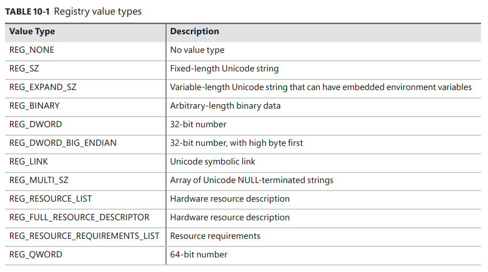

## The Registry

- It is the repository
for both systemwide and per-user settings --> plays a key role in the configuration and control of Windows systems

### Viewing and changing the registry

- `Regedit.exe` : main GUI tool for editing the registry.
- `Reg.exe` : has the ability to import, export, back up, and restore keys, as well as to compare, modify, and delete keys and values. It can also set or query flags used in UAC virtualization
- `Regini.exe` : allows you to import registry data based on text files that contain ASCII or Unicode configuration data.
- `Offreg.dll` (from WDK): Host the Offline Registry Library, this library allows loading registry key hive file in their binary format and applying operations on the files themselves, bypassing the usual logical loading and mapping that Windows requires for registry operations
### Registry usage
- When is it read?
    - During the initial boot process
    - During the kernel boot process
    - During logon, Explorer and other Windows components read per-user preferences
    - During applications startups.
- When is it modified?
    - During the installation of a device driver
    - Application setup utilities create default application settings
    - When you change application or system settings through user interface.
    - Many default settings are defined by a prototype version of the registry that ships on the Windows setup media.

### Registry data type

- Contain:
    - `keys` : consist of other keys (subkeys or values)
    - `values` : store data

### Registry logical structure

### Application hives

### Transactional Registry (TxR)

### Monitoring registry activity

### Process monitor internals

### Registry Internal

### Hive reorganization

### The registry namespace and operation

### Stable storage

### Registry filtering

### Registry virtualization

### Registry optimizations

## Windows services
## Task scheduling and UBPM
## Windows Management Instrumentation
## Event Tracing for Wndows (ETW)
## Dynamic tracing (DTrace)
## Windows Error Reporting (WER)
## Global flags
## Kernel shims

